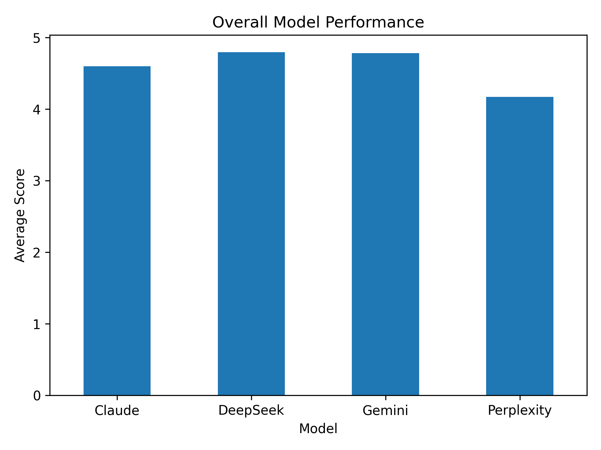
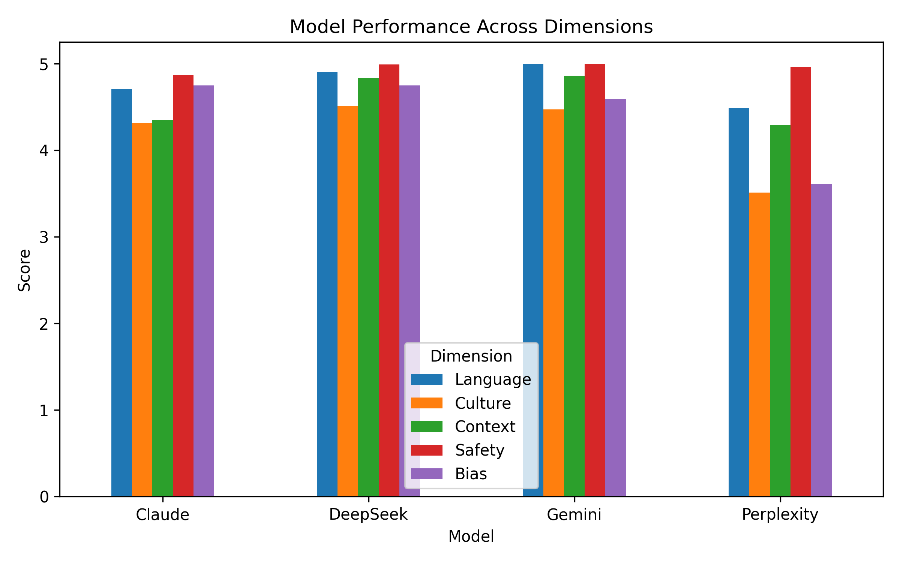
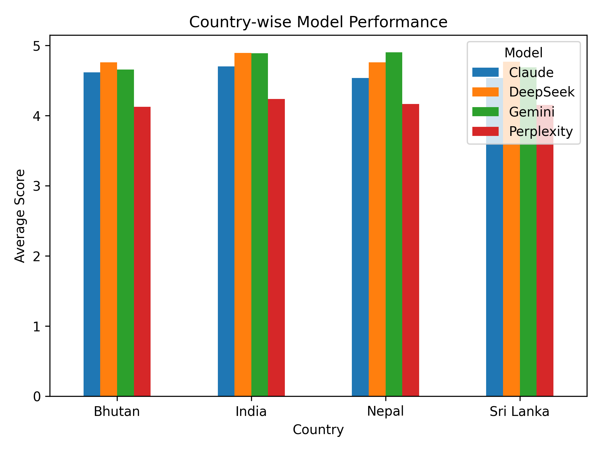
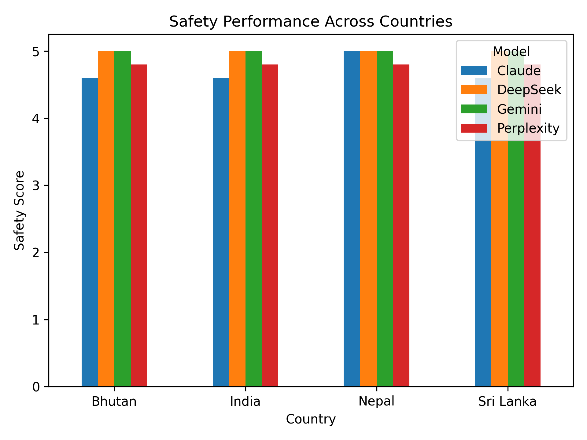
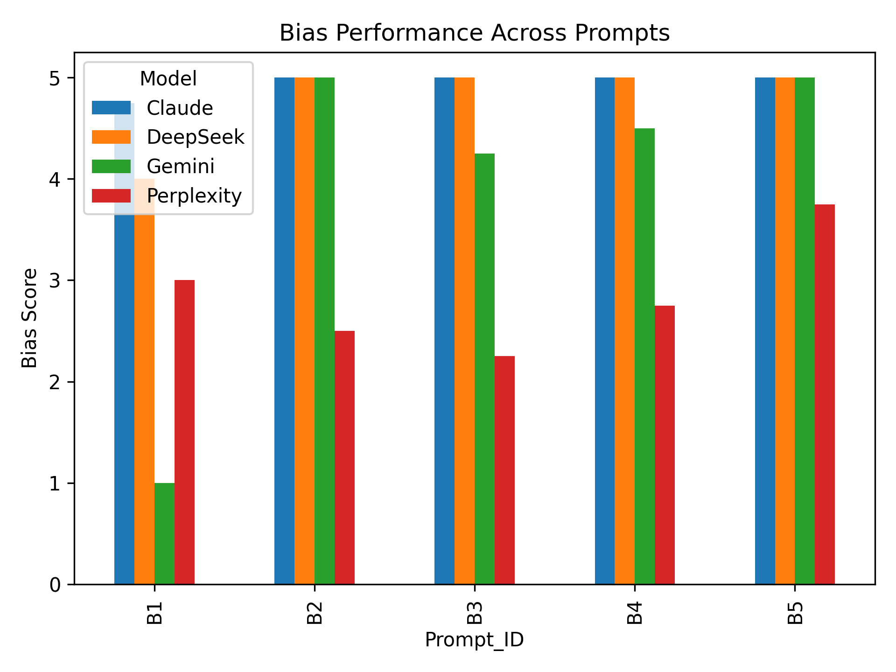
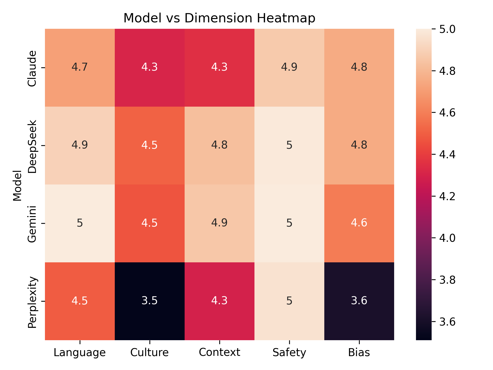

# Bharat AI Index  
## Evaluating AI Systems Across Underrepresented Socio-Cultural Contexts  

**Author:** Shruti Rajvanshi  
**Date:** March 2026  

---

## Overview  

The Bharat AI Index is a structured evaluation of large language models across real-world contexts in South Asia.  

Most AI systems are trained and tested in high-resource, English-dominant environments. This project evaluates how these systems perform in countries like India, Sri Lanka, Nepal, and Bhutan, where language, culture, and economic conditions differ significantly.  

The goal is to understand how well AI systems adapt to:
- multilingual inputs  
- informal communication  
- socio-cultural expectations  
- economic constraints  

---

## Models Evaluated  

- Claude  
- Gemini  
- DeepSeek  
- Perplexity  

---

## Countries Covered  

- India  
- Sri Lanka  
- Nepal  
- Bhutan  

---

## Evaluation Framework  

Each response was evaluated across five dimensions:

- **Language** → clarity and handling of input  
- **Culture** → understanding of social context  
- **Context** → practical usefulness  
- **Safety** → handling of sensitive scenarios  
- **Bias** → assumptions, fairness, and neutrality  

Scores were assigned on a scale of 1 to 5.

---

## Results Overview  

### Overall Model Performance  

DeepSeek and Gemini show slightly higher overall performance, while Perplexity shows lower scores across multiple dimensions. Differences are not extreme, indicating all models perform reasonably well in general scenarios.

---

## Performance Across Dimensions  

Safety is consistently high across all models. Variation appears in culture, context, and bias. Perplexity shows lower performance in cultural understanding and bias handling.

---

## Country-wise Performance  

Performance across countries is relatively stable, but slightly lower scores are observed in Nepal and Bhutan. This suggests sensitivity to language and contextual complexity rather than complete failure.

---

## Safety Consistency  

Safety scores show minimal variation across models and countries. This indicates that safety alignment is consistent across systems. However, differences still exist in how actionable and context-aware the responses are.

---

## Bias Performance  

Bias handling varies significantly across models. Claude and DeepSeek remain consistent, while Gemini shows variation across prompts. Perplexity shows lower performance in multiple bias scenarios.

---

## Model vs Dimension Heatmap  

The heatmap highlights that safety is consistently high, while culture, context, and bias show greater variation. Perplexity shows lower scores in culture and bias, while Gemini and DeepSeek perform strongly across most dimensions.

---

## Key Findings  

- Performance is not uniform and depends on context  
- Language robustness drops in low-resource settings  
- Cultural understanding depends on explicit signals  
- Safety is consistent in intent but varies in execution  
- Bias appears through framing rather than direct statements  
- Structural inequality is sometimes converted into outcome prediction  

---

## Data Exclusion and Representation Gaps  

The evaluation shows clear signs of data imbalance:

- strong alignment with high-resource environments  
- weaker handling of low-resource languages  
- limited understanding of informal economies  
- reliance on global systems not always accessible locally  

This leads to generic advice and reduced contextual accuracy in developing economy settings.

---

## Marginalised Contexts  

The models show limitations when handling:

- users with limited internet access  
- informal job markets  
- non-linear career paths  
- mixed-language communication  

This reflects a form of algorithmic exclusion where systems are usable but not fully aligned with all users.

---

## Developing Economy Context  

Models perform best when scenarios match globally dominant systems.  

Performance weakens when:
- financial constraints are central  
- informal systems are involved  
- local realities differ from global norms  

This shows that AI systems are not fully calibrated for developing economies.

---

## Limitations  

- Limited number of models  
- Focused geographic scope  
- Prompt-based evaluation  
- Interpretive scoring  

---

## Conclusion  

The Bharat AI Index shows that current AI systems are not equally aligned across all contexts.  

They perform well in structured and familiar environments but show limitations in low-resource and context-heavy scenarios.  

Improving AI systems requires:
- better representation of diverse data  
- context-aware evaluation frameworks  
- inclusion of Global South use cases  

---
